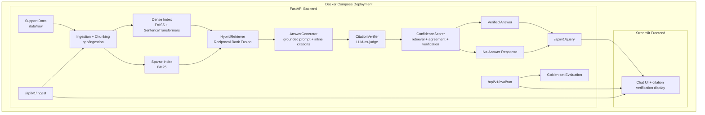

# Support Knowledge Copilot with Verified Citations

[](https://github.com/OWNER/REPO/actions/workflows/ci.yml)

Hybrid RAG support assistant that retrieves from a support knowledge base, generates grounded answers, verifies citations with an LLM judge, and refuses low-confidence answers.

## Problem

Support bots often fail in two damaging ways: they hallucinate plausible-sounding answers, and they attach citations that do not actually support the claims being made. In customer support, that can mean wrong billing advice, unsafe account recovery guidance, or wasted escalation time. This project treats citation verification and no-answer detection as first-class backend features rather than UI polish.

## Architecture



## Key Features

- **Hybrid retrieval with dense + BM25 + Reciprocal Rank Fusion**: combines semantic retrieval and exact lexical matching in [dense.py](app/retrieval/dense.py), [sparse.py](app/retrieval/sparse.py), and [fusion.py](app/retrieval/fusion.py).
- **Optional cross-encoder reranking**: fused candidates can be reranked with a SentenceTransformers CrossEncoder in [reranker.py](app/retrieval/reranker.py) before the top chunks are sent to generation.
- **Grounded answer generation with inline `[chunk_id]` citations**: generation prompt requires every factual claim to cite retrieved context in [prompts.py](app/generation/prompts.py) and [generator.py](app/generation/generator.py).
- **LLM-as-judge citation verification**: each cited claim is checked against the cited source chunk and unsupported citations are replaced with `[unverified]` in [judge.py](app/verification/judge.py).
- **Confidence-based no-answer detection**: combines retrieval strength, dense/sparse agreement, and citation verification into a 0-1 confidence score in [confidence.py](app/scoring/confidence.py).
- **Golden-set evaluation harness**: 60 hand-authored support questions, including unanswerable questions, live in [golden_set.jsonl](eval/golden_set.jsonl) and run through [run_eval.py](eval/run_eval.py).
- **Production-style API and UI**: FastAPI routes are in [app/api/routes](app/api/routes), orchestration is in [pipeline.py](app/pipeline.py), and the Streamlit demo is in [streamlit_app.py](frontend/streamlit_app.py).
- **Dockerized deployment**: backend, frontend, volumes, and healthchecks are defined in [docker-compose.yml](docker-compose.yml).

## Results

Do not paste aspirational numbers into this section. Use only numbers generated by this repository on your current corpus and eval set.

Current retrieval comparison from [reports/retrieval_comparison.md](reports/retrieval_comparison.md):

| Retriever | Hit Rate@5 | Hits | Total |
| --- | ---: | ---: | ---: |
| Dense | 100.00% | 18 | 18 |
| BM25 | 100.00% | 18 | 18 |
| Hybrid RRF | 100.00% | 18 | 18 |

Important caveat: this retrieval comparison was run on a tiny sample corpus where Hit Rate@5 saturates, so it does **not** justify a resume claim like “72% to 88% retrieval improvement.” Use it as a pipeline smoke benchmark only.

Golden-set evaluation metrics should be generated with:

```bash
python eval/run_eval.py
```

Then paste the real values from `reports/eval_summary.md` here:

| Metric | Measured Value |
| --- | --- |
| Retrieval Hit Rate | `PASTE_FROM_reports/eval_summary.md` |
| Avg Answer Correctness | `PASTE_FROM_reports/eval_summary.md` |
| Avg Citation Faithfulness | `PASTE_FROM_reports/eval_summary.md` |
| No-Answer Precision | `PASTE_FROM_reports/eval_summary.md` |
| No-Answer Recall | `PASTE_FROM_reports/eval_summary.md` |

## How Verification Works

The generator can only see retrieved chunks and is instructed to cite factual claims using exact chunk IDs like `[abc123_0]`. After generation, the verifier splits the answer into cited claims and sends each claim plus the full cited chunk to a separate LLM judge. The judge must return strict JSON with `SUPPORTED`, `PARTIALLY_SUPPORTED`, or `UNSUPPORTED`.

If a citation is unsupported, the backend does not show it as trustworthy. It replaces that marker with `[unverified]`, separates it into `flagged_citations`, and sends the result to the confidence scorer. This is the core safety idea: retrieval and generation are not trusted blindly; the final answer must survive an evidence check before the UI presents it as verified.

## Retrieval Pipeline

At query time, dense retrieval and BM25 each retrieve a wider candidate pool. The hybrid
retriever combines those ranked lists with Reciprocal Rank Fusion, which rewards chunks
that appear near the top of either retriever and especially chunks found by both. By
default, the API returns the top fused chunks directly.

For higher-quality final ordering, enable an optional cross-encoder reranker:

```text
ENABLE_RERANKER=true
RERANKER_MODEL_NAME=cross-encoder/ms-marco-MiniLM-L-6-v2
```

When enabled, the cross-encoder scores each `query + chunk` pair after RRF and reorders
the fused candidate pool before the final `top_k` chunks are sent to generation. The
original RRF scores are preserved for confidence scoring, so reranking improves ordering
without changing the retrieval-strength signal.

## Tech Stack

| Layer | Technology |
| --- | --- |
| Backend API | FastAPI, Pydantic |
| Frontend | Streamlit |
| Dense Retrieval | SentenceTransformers, FAISS |
| Sparse Retrieval | rank-bm25 |
| Fusion | Reciprocal Rank Fusion |
| LLM Provider | Anthropic SDK behind an `LLMClient` interface |
| Evaluation | pandas, custom golden set, LLM grading |
| Testing | pytest, FastAPI TestClient |
| Deployment | Docker, Docker Compose |
| Tooling | Ruff, Black, Makefile |

## Setup

```bash
python -m venv .venv
source .venv/bin/activate
pip install -r requirements.txt
cp .env.example .env
```

On Windows PowerShell:

```powershell
python -m venv .venv
.\.venv\Scripts\Activate.ps1
pip install -r requirements.txt
copy .env.example .env
```

Set `LLM_API_KEY`, `SUPPORT_COPILOT_API_KEY`, and `SUPPORT_COPILOT_ADMIN_API_KEY` in `.env`.
Use long random values for the support copilot keys, and keep the normal key separate from
the admin key. The normal key can call `POST /api/v1/query`; the admin key is required for
`POST /api/v1/ingest`, `GET /api/v1/ingest/status`, and `POST /api/v1/eval/run`.

Protected API requests must send the key in the `X-API-Key` header:

```bash
curl -X POST http://localhost:8000/api/v1/query \
  -H "X-API-Key: $SUPPORT_COPILOT_API_KEY" \
  -H "Content-Type: application/json" \
  -d '{"query": "What should I do if my reset email never arrives?", "top_k": 5}'
```

For progressive UI updates, use the Server-Sent Events endpoint:

```bash
curl -N -X POST http://localhost:8000/api/v1/query/stream \
  -H "X-API-Key: $SUPPORT_COPILOT_API_KEY" \
  -H "Content-Type: application/json" \
  -d '{"query": "What should I do if my reset email never arrives?", "top_k": 5}'
```

The stream emits `retrieval_started`, `retrieval_completed`, `generation_started`,
`verification_started`, `completed`, and `error` events. The `completed` event contains
the final answer payload under `result`; the existing `POST /api/v1/query` response is
unchanged.

Queries can optionally restrict retrieval by metadata. Supported filters include
`category`, `source_path`, `section`, and `updated_at`; category and source-path filtering
are available for both dense and BM25 retrieval. New chunks persist `category`,
`source_path`, `section`, and source-file `updated_at` metadata, and older indexes infer
category from the source filename when needed.

```bash
curl -X POST http://localhost:8000/api/v1/query \
  -H "X-API-Key: $SUPPORT_COPILOT_API_KEY" \
  -H "Content-Type: application/json" \
  -d '{
    "query": "What happens after a 429?",
    "top_k": 5,
    "filters": {
      "category": ["api-rate-limits"],
      "source_path": ["api-rate-limits.md"]
    }
  }'
```

The Streamlit sidebar includes separate fields for the normal API key and admin API key.
They can also be prefilled with `SUPPORT_COPILOT_API_KEY` and
`SUPPORT_COPILOT_ADMIN_API_KEY` environment variables. It also includes filter controls
for category, source path, and section, plus a streaming toggle that shows backend progress
while a query runs.

`POST /api/v1/query` also has a per-client sliding-window rate limit. The client is
identified by the API key, and admin-only endpoints are not included in the query limit.
Configure it in `.env`:

```text
QUERY_RATE_LIMIT_REQUESTS=60
QUERY_RATE_LIMIT_WINDOW_SECONDS=60
```

When the limit is exceeded, the API returns `429 Too Many Requests` with a `Retry-After`
header and a message explaining the configured limit. Set either value to `0` to disable
the in-memory limiter for local testing. The current store is process-local by design; use
a Redis-backed store for multi-worker deployments.

Ingestion jobs are tracked persistently in SQLite. Configure the database path with:

```text
INGESTION_JOBS_DB_PATH=data/processed/ingestion_jobs.sqlite3
```

`POST /api/v1/ingest` returns a `job_id`. Use `GET /api/v1/ingest/status` for the latest
job, or `GET /api/v1/ingest/status/{job_id}` to look up a specific job. Each job records
`status`, `files_processed`, `chunks_created`, `started_at`, `completed_at`, and
`error_message`.

The backend emits structured JSON logs and attaches a request ID to every HTTP request.
Clients may send `X-Request-ID`; otherwise the API generates one and returns it in the
`X-Request-ID` response header. `POST /api/v1/query` also includes the same value in the
JSON response body as `request_id`.

Each completed query emits a `rag_query_completed` log event with:

```text
request_id
status
confidence
retrieved_chunks_count
retrieval_latency_ms
generation_latency_ms
verification_latency_ms
total_latency_ms
```

Logs intentionally do not include API keys or auth headers. Configure verbosity with:

```text
LOG_LEVEL=INFO
```

Citation verification judge calls can be cached in SQLite:

```text
ENABLE_JUDGE_CACHE=true
JUDGE_CACHE_DB_PATH=data/processed/judge_cache.sqlite3
```

The cache key is a stable hash of the claim excerpt, cited `chunk_id`, and source chunk
text. On repeated answers over the same source evidence, the backend can reuse the stored
verdict and reasoning instead of calling the LLM judge again. This lowers verification
latency and reduces provider cost while preserving the same answer flow. Cache rows also
store `created_at`, `model_name`, and `prompt_version` for auditability.

Answer feedback is collected through `POST /api/v1/feedback` and persisted in SQLite:

```text
FEEDBACK_DB_PATH=data/processed/feedback.sqlite3
```

The endpoint requires the normal `X-API-Key` header and stores the original `query`,
`answer`, answer `status`, `confidence`, `rating` (`up` or `down`), optional `comment`,
and cited `citation_chunk_ids`. The Streamlit UI shows thumbs up/down controls after each
assistant answer and sends the same fields automatically.

Example feedback request:

```bash
curl -X POST http://localhost:8000/api/v1/feedback \
  -H "X-API-Key: $SUPPORT_COPILOT_API_KEY" \
  -H "Content-Type: application/json" \
  -d '{
    "query": "How do I reset my password?",
    "answer": "Use Forgot password from the sign-in page.",
    "status": "answered",
    "confidence": 0.91,
    "rating": "up",
    "comment": "Helpful answer",
    "citation_chunk_ids": ["chunk_0"]
  }'
```

Build local chunks and indexes:

```bash
python scripts/run_ingestion.py
python scripts/build_indexes.py
```

Run the API:

```bash
uvicorn app.main:app --reload
```

Run the frontend:

```bash
streamlit run frontend/streamlit_app.py
```

Open:

- API docs: `http://localhost:8000/docs`
- Streamlit UI: `http://localhost:8501`

## Docker

```bash
cp .env.example .env
docker compose up --build
```

First-time ingestion inside Docker:

```bash
curl -X POST http://localhost:8000/api/v1/ingest \
  -H "X-API-Key: $SUPPORT_COPILOT_ADMIN_API_KEY"
```

Open:

- Streamlit UI: `http://localhost:8501`
- API docs: `http://localhost:8000/docs`
- Health check: `http://localhost:8000/health`

Docker Compose uses named volumes for `data/raw`, `data/processed`, and `indexes` so documents, chunks, and FAISS/BM25 indexes survive container restarts. Healthchecks plus `depends_on: condition: service_healthy` keep the frontend from starting before the backend is ready.

Run the Docker smoke test:

```bash
./scripts/docker_smoke_test.sh
```

## Production Deployment

Keep [docker-compose.yml](docker-compose.yml) for local development. For a single-host
production-style deployment, use [docker-compose.prod.yml](docker-compose.prod.yml). It
keeps the backend private on the Docker network, binds Streamlit to localhost by default,
adds restart policies, and health-checks both services.

Create a deployment env file on the host. Do not commit real secrets:

```bash
cp .env.example .env.prod
```

Set at least these values:

| Variable | Required | Purpose |
| --- | --- | --- |
| `LLM_API_KEY` | Yes | Provider key used for generation, verification, and eval grading. |
| `SUPPORT_COPILOT_API_KEY` | Yes | Normal API key for query and feedback requests. |
| `SUPPORT_COPILOT_ADMIN_API_KEY` | Yes | Admin key for ingestion and evaluation endpoints. |
| `LLM_PROVIDER` | No | Defaults to `gemini`; also supports `anthropic`. |
| `LLM_MODEL_NAME` | No | Model used for answer generation and judge calls. |
| `QUERY_RATE_LIMIT_REQUESTS` | No | Query requests allowed per API key per window. |
| `QUERY_RATE_LIMIT_WINDOW_SECONDS` | No | Rate limit window size. |
| `ENABLE_JUDGE_CACHE` | No | Enables SQLite caching for repeated citation judge calls. |
| `JUDGE_CACHE_DB_PATH` | No | SQLite path for judge cache rows. |
| `INGESTION_JOBS_DB_PATH` | No | SQLite path for ingestion job status. |
| `FEEDBACK_DB_PATH` | No | SQLite path for answer feedback. |
| `FRONTEND_BIND_ADDRESS` | No | Defaults to `127.0.0.1` so Nginx can proxy privately. |
| `FRONTEND_PORT` | No | Host port for Streamlit, default `8501`. |
| `BACKEND_IMAGE` / `FRONTEND_IMAGE` | No | Override image tags when using a registry. |

Start production compose:

```bash
docker compose --env-file .env.prod -f docker-compose.prod.yml up -d --build
docker compose --env-file .env.prod -f docker-compose.prod.yml ps
```

Because the production compose file keeps the backend private, run first-time ingestion
inside the backend container:

```bash
docker compose --env-file .env.prod -f docker-compose.prod.yml exec backend \
  curl -X POST http://localhost:8000/api/v1/ingest \
  -H "X-API-Key: $SUPPORT_COPILOT_ADMIN_API_KEY"
```

Health checks:

```bash
docker compose --env-file .env.prod -f docker-compose.prod.yml ps
docker compose --env-file .env.prod -f docker-compose.prod.yml logs backend
```

The backend health endpoint is `/health`; the Streamlit health endpoint is
`/_stcore/health`. Both containers use `restart: unless-stopped`, so they restart after
process failures and host reboots unless explicitly stopped.

### Nginx Reverse Proxy

Terminate TLS at Nginx and proxy to the locally bound Streamlit port. Keep API keys and
LLM keys only in the backend container environment; they should not be hardcoded in Nginx
or committed files.

```nginx
server {
    listen 80;
    server_name support-copilot.example.com;
    return 301 https://$host$request_uri;
}

server {
    listen 443 ssl http2;
    server_name support-copilot.example.com;

    ssl_certificate /etc/letsencrypt/live/support-copilot.example.com/fullchain.pem;
    ssl_certificate_key /etc/letsencrypt/live/support-copilot.example.com/privkey.pem;

    location / {
        proxy_pass http://127.0.0.1:8501;
        proxy_http_version 1.1;
        proxy_set_header Host $host;
        proxy_set_header X-Real-IP $remote_addr;
        proxy_set_header X-Forwarded-For $proxy_add_x_forwarded_for;
        proxy_set_header X-Forwarded-Proto $scheme;
        proxy_set_header Upgrade $http_upgrade;
        proxy_set_header Connection "upgrade";
        proxy_read_timeout 300s;
    }
}
```

For direct backend API exposure, prefer a separate Nginx location with TLS, request-size
limits, and your existing `X-API-Key` authentication. The compose template intentionally
does not publish backend port `8000` to the host.

## Developer Commands

```bash
make install
make lint
make format
make test
make ingest
make build-indexes
make run-api
make run-frontend
make eval
make docker-up
```

Direct lint/format commands:

```bash
ruff check .
black --check .
black .
ruff check . --fix
```

Run the same local checks as CI:

```bash
ruff check .
black --check .
pytest
docker build --file Dockerfile.backend --tag support-knowledge-copilot-backend:local .
docker build --file Dockerfile.frontend --tag support-knowledge-copilot-frontend:local .
```

Replace `OWNER/REPO` in the CI badge URL after publishing the repository on GitHub.

## Folder Structure

```text
support-knowledge-copilot/
├── app/
│   ├── api/                  # FastAPI schemas, dependencies, routes
│   ├── generation/           # Grounded prompts, answer generator, no-answer response
│   ├── ingestion/            # Loaders, chunker, ingestion pipeline
│   ├── llm/                  # LLM client interface + Anthropic implementation
│   ├── retrieval/            # Dense, sparse, hybrid, RRF interfaces
│   ├── scoring/              # Confidence scoring
│   ├── verification/         # LLM-as-judge citation verification
│   └── main.py               # FastAPI app
├── data/raw/                 # Sample support docs
├── data/processed/           # Generated chunks JSONL
├── eval/                     # Golden set and evaluation scripts
├── frontend/                 # Streamlit app and API client
├── indexes/                  # Dense and sparse index artifacts
├── reports/                  # Evaluation reports
├── scripts/                  # CLI utilities and Docker smoke test
├── tests/                    # Unit and integration tests
├── Dockerfile.backend
├── Dockerfile.frontend
└── docker-compose.yml
```

## Known Limitations And Future Work

- Add a cross-encoder reranker after hybrid retrieval for better final ordering.
- Add streaming responses over FastAPI and Streamlit.
- Add multi-turn conversation memory with explicit source tracking.
- Persist ingestion job status outside process memory for multi-worker deployments.
- Cache citation judge calls by `claim + chunk_id` to reduce LLM cost.
- Add authentication and rate limiting for production API exposure.
- Expand the corpus and golden set before making public benchmark claims.

## License

MIT. See [LICENSE](LICENSE).
