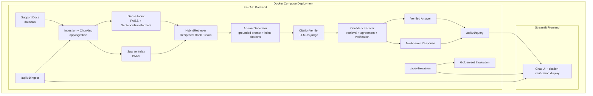

# Support Knowledge Copilot with Verified Citations

Hybrid RAG support assistant that retrieves from a support knowledge base, generates grounded answers, verifies citations with an LLM judge, and refuses low-confidence answers.

## Problem

Support bots often fail in two damaging ways: they hallucinate plausible-sounding answers, and they attach citations that do not actually support the claims being made. In customer support, that can mean wrong billing advice, unsafe account recovery guidance, or wasted escalation time. This project treats citation verification and no-answer detection as first-class backend features rather than UI polish.

## Architecture



## Key Features

- **Hybrid retrieval with dense + BM25 + Reciprocal Rank Fusion**: combines semantic retrieval and exact lexical matching in [dense.py](app/retrieval/dense.py), [sparse.py](app/retrieval/sparse.py), and [fusion.py](app/retrieval/fusion.py).
- **Grounded answer generation with inline `[chunk_id]` citations**: generation prompt requires every factual claim to cite retrieved context in [prompts.py](app/generation/prompts.py) and [generator.py](app/generation/generator.py).
- **LLM-as-judge citation verification**: each cited claim is checked against the cited source chunk and unsupported citations are replaced with `[unverified]` in [judge.py](app/verification/judge.py).
- **Confidence-based no-answer detection**: combines retrieval strength, dense/sparse agreement, and citation verification into a 0-1 confidence score in [confidence.py](app/scoring/confidence.py).
- **Golden-set evaluation harness**: 60 hand-authored support questions, including unanswerable questions, live in [golden_set.jsonl](eval/golden_set.jsonl) and run through [run_eval.py](eval/run_eval.py).
- **Production-style API and UI**: FastAPI routes are in [app/api/routes](app/api/routes), orchestration is in [pipeline.py](app/pipeline.py), and the Streamlit demo is in [streamlit_app.py](frontend/streamlit_app.py).
- **Dockerized deployment**: backend, frontend, volumes, and healthchecks are defined in [docker-compose.yml](docker-compose.yml).

## Results

Do not paste aspirational numbers into this section. Use only numbers generated by this repository on your current corpus and eval set.

Current retrieval comparison from [reports/retrieval_comparison.md](reports/retrieval_comparison.md):

| Retriever | Hit Rate@5 | Hits | Total |
| --- | ---: | ---: | ---: |
| Dense | 100.00% | 18 | 18 |
| BM25 | 100.00% | 18 | 18 |
| Hybrid RRF | 100.00% | 18 | 18 |

Important caveat: this retrieval comparison was run on a tiny sample corpus where Hit Rate@5 saturates, so it does **not** justify a resume claim like “72% to 88% retrieval improvement.” Use it as a pipeline smoke benchmark only.

Golden-set evaluation metrics should be generated with:

```bash
python eval/run_eval.py
```

Then paste the real values from `reports/eval_summary.md` here:

| Metric | Measured Value |
| --- | --- |
| Retrieval Hit Rate | `PASTE_FROM_reports/eval_summary.md` |
| Avg Answer Correctness | `PASTE_FROM_reports/eval_summary.md` |
| Avg Citation Faithfulness | `PASTE_FROM_reports/eval_summary.md` |
| No-Answer Precision | `PASTE_FROM_reports/eval_summary.md` |
| No-Answer Recall | `PASTE_FROM_reports/eval_summary.md` |

## How Verification Works

The generator can only see retrieved chunks and is instructed to cite factual claims using exact chunk IDs like `[abc123_0]`. After generation, the verifier splits the answer into cited claims and sends each claim plus the full cited chunk to a separate LLM judge. The judge must return strict JSON with `SUPPORTED`, `PARTIALLY_SUPPORTED`, or `UNSUPPORTED`.

If a citation is unsupported, the backend does not show it as trustworthy. It replaces that marker with `[unverified]`, separates it into `flagged_citations`, and sends the result to the confidence scorer. This is the core safety idea: retrieval and generation are not trusted blindly; the final answer must survive an evidence check before the UI presents it as verified.

## Tech Stack

| Layer | Technology |
| --- | --- |
| Backend API | FastAPI, Pydantic |
| Frontend | Streamlit |
| Dense Retrieval | SentenceTransformers, FAISS |
| Sparse Retrieval | rank-bm25 |
| Fusion | Reciprocal Rank Fusion |
| LLM Provider | Anthropic SDK behind an `LLMClient` interface |
| Evaluation | pandas, custom golden set, LLM grading |
| Testing | pytest, FastAPI TestClient |
| Deployment | Docker, Docker Compose |
| Tooling | Ruff, Black, Makefile |

## Setup

```bash
python -m venv .venv
source .venv/bin/activate
pip install -r requirements.txt
cp .env.example .env
```

On Windows PowerShell:

```powershell
python -m venv .venv
.\.venv\Scripts\Activate.ps1
pip install -r requirements.txt
copy .env.example .env
```

Set `LLM_API_KEY` in `.env`.

Build local chunks and indexes:

```bash
python scripts/run_ingestion.py
python scripts/build_indexes.py
```

Run the API:

```bash
uvicorn app.main:app --reload
```

Run the frontend:

```bash
streamlit run frontend/streamlit_app.py
```

Open:

- API docs: `http://localhost:8000/docs`
- Streamlit UI: `http://localhost:8501`

## Docker

```bash
cp .env.example .env
docker compose up --build
```

First-time ingestion inside Docker:

```bash
curl -X POST http://localhost:8000/api/v1/ingest
```

Open:

- Streamlit UI: `http://localhost:8501`
- API docs: `http://localhost:8000/docs`
- Health check: `http://localhost:8000/health`

Docker Compose uses named volumes for `data/raw`, `data/processed`, and `indexes` so documents, chunks, and FAISS/BM25 indexes survive container restarts. Healthchecks plus `depends_on: condition: service_healthy` keep the frontend from starting before the backend is ready.

Run the Docker smoke test:

```bash
./scripts/docker_smoke_test.sh
```

## Developer Commands

```bash
make install
make lint
make format
make test
make ingest
make build-indexes
make run-api
make run-frontend
make eval
make docker-up
```

Direct lint/format commands:

```bash
ruff check .
black .
ruff check . --fix
```

## Folder Structure

```text
support-knowledge-copilot/
├── app/
│   ├── api/                  # FastAPI schemas, dependencies, routes
│   ├── generation/           # Grounded prompts, answer generator, no-answer response
│   ├── ingestion/            # Loaders, chunker, ingestion pipeline
│   ├── llm/                  # LLM client interface + Anthropic implementation
│   ├── retrieval/            # Dense, sparse, hybrid, RRF interfaces
│   ├── scoring/              # Confidence scoring
│   ├── verification/         # LLM-as-judge citation verification
│   └── main.py               # FastAPI app
├── data/raw/                 # Sample support docs
├── data/processed/           # Generated chunks JSONL
├── eval/                     # Golden set and evaluation scripts
├── frontend/                 # Streamlit app and API client
├── indexes/                  # Dense and sparse index artifacts
├── reports/                  # Evaluation reports
├── scripts/                  # CLI utilities and Docker smoke test
├── tests/                    # Unit and integration tests
├── Dockerfile.backend
├── Dockerfile.frontend
└── docker-compose.yml
```

## Known Limitations And Future Work

- Add a cross-encoder reranker after hybrid retrieval for better final ordering.
- Add streaming responses over FastAPI and Streamlit.
- Add multi-turn conversation memory with explicit source tracking.
- Persist ingestion job status outside process memory for multi-worker deployments.
- Cache citation judge calls by `claim + chunk_id` to reduce LLM cost.
- Add authentication and rate limiting for production API exposure.
- Expand the corpus and golden set before making public benchmark claims.

## License

MIT. See [LICENSE](LICENSE).
